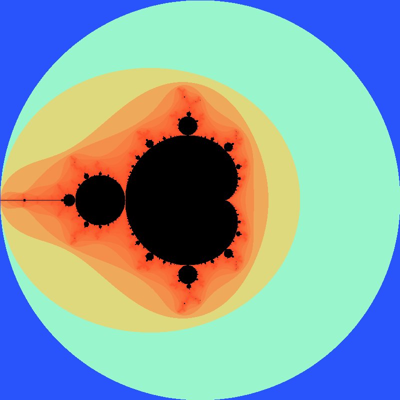

**Milestone 1** Thursday, Apr 23rd by 11:59 PM

**Milestone 2** Tuesday, May 5th by 11:59 PM

Getting Started
===============

Download [CS201\_Assign05\_Gradle.zip](CS201_Assign05_Gradle.zip). Extract the zip file and import it into Cloud9 (or Eclipse **File&rarr;Import...&rarr;Gradle&rarr;Existing Gradle Project**.) You should see a project called **CS201\_Assign05\_Gradle** in the package explorer.

In the terminal window at the bottom of the Cloud9 IDE

    cd ~
    cd environment/CS201_Assign05_Gradle

<!--
Download [CS201\_Lab16.zip](CS201_Lab16.zip). Import it into Eclipse (**File&rarr;Import...&rarr;Existing Projects into Workspace&rarr;Archive File**.) You should see a project called **CS201\_Lab16** in the package explorer.
-->

The Mandelbrot Set
==================

The Mandelbrot set is a fractal: a mathematical object that is self-similar at all scales. It is defined as follows:

-   Each point on the x/y plane is interpreted as a [complex number](http://en.wikipedia.org/wiki/Complex_number), where x is the real part and y is the imaginary part.

-   A point (x,y) is considered to be in the set if, for its corresponding complex number C the equation

    > Z<sub>n+1</sub> = (Z<sub>n</sub>)<sup>2</sup> + C

    can be iterated any number of times without the magnitude of Z ever becoming greater than 2.0. The initial value of Z (Z<sub>0</sub>) is (0+0i).

Note that the magnitude of a complex number is the square root of the sum of the squares of its real and imaginary components. See the Wikipedia article linked above for an explanation of how to add and multiply complex numbers.

Your Task
=========

Your task is to implement a renderer for the [Mandelbrot Set](http://en.wikipedia.org/wiki/Mandelbrot_set), using [parallel computation](../lectures/lecture17.html) to speed up the rendering process. 

For example, using the default values produces the following generated output file (click to see larger version):

> <a href="img/assign05/defaultoutput.png"></a>

As a second example, (user input in **bold**):

<pre>
Please enter coordinates of region to render:
  x1: <b>-1.286667</b>
  y1: <b>-0.413333</b>
  x2: <b>-1.066667</b>
  y2: <b>-0.193333</b>
Output filename: <b>output.png</b>
Choose a color chooser:
   1 - Simple Gradient
   2 - Color Mapping
<b>1</b>
Enter the number of threads to use: <b>1</b>
Working...
Output file written successfully!
</pre>

Should generate an output file that looks something like this (click to see larger version):

> <a href="img/assign05/output1.png"></a>

**Mandelbrot** class

The program has commented code to prompt the user for a pair of x,y coordinates specifying corners of a rectangle in the x/y plane, the default coordinates are (-2,-2) to (2,2). The program also has commented code to prompt the user to enter the name of a file ending with the ".png" file extension, the default filename is **output.png**. Next, the program has commented code to prompt the user to select a color palette, the default is the provided SimpleGradientColorChooser. Lastly, the program has commented code to prompt the user for the number of parallel threads to use, the default is 1. The program will render an 800 pixel by 800 pixel image which visualizes the specified region of the Mandelbrot set.

Your task is to implement the **computeIterations()** method which will create a set of **MandelbrotTask** objects and assign them to separate threads for execution. Code has been provided to generate the output image once all the threads have completed.

<blockquote style="text-align: center;">

<br>Apologies to <a href="http://hyperboleandahalf.blogspot.com/">Allie Brosh</a>
</blockquote>

**MandelbrotTask** class

You will also need to implement the **MandelbrotTask** class by
>-  Adding a constructor to accept the bounds for the points the task is responsible for computing
>-  Implementing the **run()** method (inherited from **Runnable** to loop over the region and compute each point
>-  Implementing the **computeIterCount()** method which will take each point in the array from **startCol** to **endCol** and **startRow** to **endRow**, and determine the number of iterations based on the Mandelbrot equation until the magnitude of the point exceeds 2.0 (or reaches the maximum number of iterations)
>-  Implementing the **getComplex()** method to compute the initial complex value from the region bounds and the array row and column.

**Complex** class

Because the core computation is based on complex numbers, having a class to represent complex numbers will make implementing the computation much easier. Your task is to implement the **add()**, **multiply()**, and **getMagnitude()** methods for complex numbers as described in the comments.

**ColorMappingColorChooser** class

The **ColorMappingColorChooser** class has been supplied.  It implements the **ColorChooser** interface, which has a single method: **getColor()**.  After you have completed the following tasks, **getColor()** will return colors based on the frequency of occurrence of each iterCount.

Your task is to finish implementing the following three methods. JUnit test cases have been provided for the **createIterSpectrumMap()** and **createIterColorMap()** methods.  Additional implementation details are provided below.


    public TreeMap<Integer, Integer> createIterCountMap(int[][] iterCounts) {
        // Run through the iterCounts array passed to the method, and create
        // a map of the distinct iterCount values, along with the number of
        // occurrences of each iterCount value.  This Map will be used to
        // create the iterSpectrumMap

        // TODO: supply implementation here...

        // now we have a mapping of each iterCount with its respective frequency
        return iterCountMap;
    }

    public HashMap<Integer, Integer> createIterSpectrumMap(int[][] iterCounts) {
        // Run through the iterCountMap, and calculate the relative location
        // of each unique iterCount within the Color Spectrum, and map that
        // location to each iterCount from the iterCountMap.  This is not the
        // Color, but rather the position in the Color Spectrum for each
        // iterCount value.  This Map will be used to create the iterColorMap.

        // TODO: supply implementation here...		

        // now we have a mapping for each iterCount to its respective
        // location in the color spectrum
        return iterSpectrumMap;
    }

    public HashMap<Integer, Color> createIterColorMap(int[][] iterCounts) {
        // Run through the iterSpectrumMap and calculate the RGB color values
        // based on each iterCount's relative spectrum location from the
        // iterSpectrum Map.  This will map the iterCounts from iterCountMap
        // to RGB color values

        // TODO: supply implementation here...	

        // now we have a mapping from each distinct iterCount to its respective
        // Color, based on its relative frequency of occurrence
        return iterColorMap;		
    }


Using this class (you'll need to uncomment the selection code in the **main** method in the **Mandelbrot** class should produce something similar to the following output file (click to see larger version):

> <a href="img/assign05/chooseroutput.png"></a>


Hints
=====

Creating the MandelbrotTask class
---------------------------------

Here is a suggested skeleton:


public class MandelbrotTask implements Runnable {
    private double x1, y1, x2, y2;
    private int startCol, endCol, startRow, endRow;
    private int[][] iterCounts;

    public MandelbrotTask(double x1, double y1, double x2, double y2,
                          int startCol, int endCol, int startRow, int endRow,
                          int[][] iterCounts) {
        this.x1 = x1;
        this.y1 = y1;
        this.x2 = x2;
        this.y2 = y2;
        this.startCol = startCol;
        this.endCol = endCol;
        this.startRow = startRow;
        this.endRow = endRow;
        this.iterCounts = iterCounts;
    }

    public void run() {
        for (int i = startRow; i < endRow; i++) {
            for (int j = startCol; j < endCol; j++) {
                Complex c = getComplex(i, j);
                int iterCount = computeIterCount(c);
                iterCounts[i][j] = iterCount;
            }
        }
    }

    // TODO: implement getComplex and computeIterCount methods
}


The idea is that a **MandelbrotTask** object will compute iteration counts for the region of the image with rows from **startRow** (inclusive) to **endRow** (exclusive) and columns from **startCol** (inclusive) to **endCol** (exclusive). The region of the complex plane is specified by **x1**, **y1**, **x2**, and **y2**.  The **iterCounts** array is the single global array used to store the iteration counts for the overall image (where the first dimension is rows and the second dimension is columns).

From the **main** method, **computeIterations()** can then be called to create **MandelbrotTask**s. For example,


MandelbrotTask task = MandelbrotTask(x1, y1, x2, y2, 0, WIDTH, 0, HEIGHT, iterCounts);
task.run();


would compute the entire image using **a single process** *without* **threads**.

Rendering the Mandelbrot Set
----------------------------

Rendering the Mandelbrot set is done by assigning a color to sampled points in a region of the x/y plane.

Code is provided in **SimpleGradientColorChooser** to render points that are in the Mandelbrot set as black. Points that are outside the Mandelbrot set will be rendered using a color that indicates how many times the equation was iterated before the magnitude of Z reached 2.0. In this implementation, the **g** and **b** channels will scale logarithmically with the number of iterations.

The renderer will convert each of the iteration array values in the 800 by 800 array into a **BufferedImage** object based on whether or not the point is in the set, and if not, how many iterations were required to show that it is not in the set using the selected **colorChooser** palette.

Once the image has been rendered into the **BufferedImage** object, code has been provided to write it to a file as follows:


OutputStream os = new BufferedOutputStream(new FileOutputStream(fileName));
try {
    ImageIO.write(bufferedImage, "PNG", os);
} finally {
    os.close();
}


Parallelism
-----------

The computation performed by the program can take a fair amount of CPU time. However, the computation of the number of iterations for each point is *independent* of the computations for all other points. Therefore, you can speed the program up by using multiple threads to compute the number of iterations in different parts of the overall region.

For example, you might divide the overall region into quadrants or horizontal/vertical strips, and use a separate thread to compute the points in each part. Then if, for example, you use four threads, if you run the program on a computer with 4 CPU cores there could be up to a 4 times speedup.

**Suggestion**: Create multiple **MandelbrotTask** objects, and execute each one in a separate thread within the **computeIterations()** method in the **Mandelbrot** class.

ColorMappingColorChooser class
------------------------------

Since the **iterCount** values do not distribute uniformly across all possible values, many of the **iterCount** values tend to bunch up into tight groups.

The **ColorMappingColorChooser** class addresses the issue of the non-uniform distribution of the **iterCount** values by mapping colors to **iterCount** values based on their *frequency* of occurrence, rather than strictly on their value.  The frequency of occurence of each **iterCount** value determines the width of the color spectrum that applies to that **iterCount**.  The spectrum width determines the distance between the colors assigned to the distinct **iterCount** values.

Creating an instance of **ColorMappingColorChooser** requires the creation of three separate maps:
- **iterCountMap** maps each distinct **iterCount** value to the number of times it occurs in the **iterCounts** array.  This determines the frequency of occurrence and the relative width of the spectrum band (distance between the adjacent **iterCounts**).
- **iterSpectrumMap** maps each distinct **iterCount** value to the relative location in the color spectrum.  The values in the **iterCountMap** are used to find the locations for each **iterCount** in the color spectrum.  The **iterCounts** are sorted in ascending order and the widths of the prior spectrum bands are summed together to determine the relative location of each **iterCount** in the color spectrum.  Each **iterCount** is then centered within its spectrum band.
- **iterColorMap** maps each distinct **iterCount** value to its RGB color.  The relative location in the color spectrum for each **iterCount** value is pulled from the **iterSpectrumMap** and is then used inside the trignometric **sine** and **cosine** functions to provide smooth transitions between red, green, and blue.

*Creating the iterCountMap*

The **createIterCountMap()** method accepts a reference to the **iterCounts** array and returns a reference to the **iterCountMap** that it creates from the **iterCounts** array contents.  The **iterCountMap** correlates each distinct **iterCount** with the number of times it occurs in the **iterCounts** array.

The method must iterates through the **iterCounts** array, and it will either encounter a new entry (and initialize the occurrence count for that entry) or update the occurrence count for an existing entry.  When iteration is complete, the method should return a reference to the newly populated map.

*Creating the iterSpectrumMap*

The **createIterSpectrumMap()** method accepts a reference to the **iterCounts** array and returns a reference to the **iterSpectrumMap** that it creates from the **iterCountMap** contents.  The **iterSpectrumMap** correlates each distinct **iterCount** with its location in the color spectrum.  **createIterColorMap** will then assign a distinct color to each **iterCount** based on the contents of **iterSpectrumMap**.

The method must iterate through the keys of the **iterCountMap**, in ascending order, and accumulate the location of each **iterCount** from the beginning of the color spectrum.  The occurrence count for each **iterCountMap** key determines the width of the spectrum band that the **iterCount** occupies.  The sum of the prior occurence counts (widths or spectrum bands) determines the location of the leading edge of the next **iterCount** spectrum band.  Each **iterCount** is then centered in its spectrum band:

       centered location = leading edge location + (width / 2) + 1

The above result is then stored as the value in the **iterSpectrumMap** with its respective **iterCount** key.

At the end of iteration, the width of the entire spectrum (the sum of all the values in the **iterSpectrumMap**) is stored in the class field **maxLocation**.  The method then returns a reference to the newly populated map. 

*Creating the iterColorMap*

The **createIterColorMap()** method accepts a reference to the **iterCounts** array and returns a reference to the **iterColorMap** that it creates from the **iterSpectrumMap** contents.  The **iterColorMap** correlates each distinct iterCount with its corresponding RGB color value.

The method must iterate through the **iterSpectrumMap** to get the spectrum location for each distinct **iterCount**  The spectrum location is then used to determine the red, green, and blue color components for that **iterCount**.  Each **iterCount** key and its respective color value are then stored in the **iterColorMap**.  The **getColor()** method then returns the color associated with each **iterCount** by looking up the color in the **iterColorMap**.

The calculations for the red, green, and blue color components for each **iterCount** use its relative spectrum location:

        relative spectrum location = spectrum location / maxLocation
		
combined with the **sine** and **cosine** trig functions to generate smooth transitions between the composite RGB spectrum colors.  The color component calculations are:

```
red = sin(spectrum location / maxLocation * PI/2) * 255

green = sin(spectrum location / maxLocation * PI) * 255

blue = cos(spectrum location / maxLocation * PI/2) * 255
```

The color value is then created from:

        color = new Color(red, green, blue)
		
and is assigned to the **iterColorMap** with its respective **iterCount** key.  

The RGB color generation graph for the above scheme is shown below:

> <a href="img/assign06/TrigColorGeneration.png"></a>

Grading Criteria
================

# Milestone 1:

* **Complex** class: 20%
* Render image with *single* thread (**computeIterations()**): 20%
* **MandelbrotTask** class:
   * Constructor: 10%
   * **run()**: 20%
   * **computeIterCount()**: 20%
   * **getComplex()**: 10%

# Milestone 2:

* Render image with multiple threads (**computeIterations()**): 40%
* **ColorMappingColorChooser** class:
   * **createIterCountMap()**: 20%
   * **createIterSpectrumMap()**: 20%
   * **createIterColorMap()**: 20%


Running Test Cases
==================

From the terminal window at the bottom of the Cloud9 IDE, 

    gradle build

Running The Program
===================

From the terminal window at the bottom of the Cloud9 IDE, 

    gradle build

Submitting
==========

When you are done, submit the lab to the Marmoset server using

    make submit_ms1
    
or
    make submit_ms2
    
If you receive a permission denied error, type

    chmod 755 submitToMarmoset.pl

and try submitting again.

<!--
# Submitting

When you are done, submit the assignment to the Marmoset server using one of the methods below.

From Eclipse
------------

If you have the [Simple Marmoset Uploader Plugin](../resources.html) installed, select the project (**CS201\_Assign05**) in the package explorer and then click the blue up arrow button in the toolbar. Enter your Marmoset username and password when prompted.

This is the recommended way to submit your work.

From a web browser
------------------

Save the project (**CS201\_Assign05**) to a zip file by right-clicking it and choosing

> **Export...&rarr;Archive File**

Upload the saved zip file to the Marmoset server as **assign05**. The server URL is

> <https://cs.ycp.edu/marmoset/>

Use this method only if there is some reason why you can't use the plugin.

After you submit
----------------

**Very important**: After you submit the assignment, please log into the Marmoset server (<https://cs.ycp.edu/marmoset>) and check the files you submitted to make sure that they are correct.

*It is your responsibility to make sure that you have submitted your work correctly.*
-->